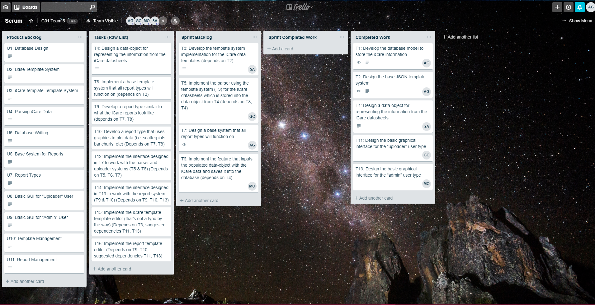

# Team5

## Team Members
* Alexander Greff
* Saad Syed Ali
* Mohammed Osumah
* Gyeongwon Choi

## Table of Contents
- [Setting Up](#Setting-Up)
  - [Production](#Production)
  - [Development Environment](#Development-Environment)
  - [Testing](#Testing)
  - [System Demos](#System-Demos)
- [Product Backlog](#Product-Backlog)
  - [Version 0](#Version-0)
  - [Version 1](#Version-1)
  - [Version 2](#Version-2)
- [Sprint Backlog](#Sprint-Backlog)
  - [Sprint 1](#Sprint-1)
  - [Sprint 2](#Sprint-2)
  - [Sprint 3](#Sprint-3)
  - [Sprint 4](#Sprint-4)
- [Deliverables](#Deliverables)
  - [Deliverable 1: Team Setup](#Deliverable-1:-Team-Setup)
  - [Deliverable 2: Project Requirements](#Deliverable-2:-Project-Requirements)
  - [Deliverable 3: Project Planning and Execution](#Deliverable-3:-Project-Planning-and-Execution)
  - [Deliverable 4: Product Validation](#Deliverable-4:-Product-Validation)
  - [Deliverable 5: Final Deliverable](#Deliverable-5:-Final-Deliverable)


## Setting Up

### Production
- (Will be completed for the final deliverable...)

### Development Environment
- Java 1.8.0 or above installed
- Install [Maven 3.5.4](https://maven.apache.org/download.cgi)
- Compile the project

  ``` $ mvn compile ```

### Testing

- Run all tests

  ``` $ mvn test ```

### System Demos

Run these commands from the project root:

``` $ mvn compile ```

* **Uploader GUI Interface:** 

    ``` $ mvn exec:java@uploader-interface-demo ```

* **Admin GUI Interface:**

    ``` $ mvn exec:java@admin-interface-demo ```

* **Database Driver:**

    ``` $ mvn exec:java@database-driver-demo ```

* **Configuration Loader:** 

    ``` $ mvn exec:java@config-loader-demo ```

* **JSON Loader:** 

    ``` $ mvn exec:java@json-loader-demo ```

<!-- * **Template System:** TODO -->

## Product Backlog

### Version 0
* [Personas v0](product_backlog/v0/personas_0.pdf)
* [User Stories v0](product_backlog/v0/user_stories_0.pdf)
* Tasks: (not developed at this point)

### Version 1
* [Personas v1](product_backlog/v1/personas_1.pdf)
* [User Stories v1](product_backlog/v1/user_stories_1.pdf)
* [Tasks v1](product_backlog/v1/tasks_1.pdf)

### Version 2
* [Personas v2](product_backlog/v2/personas_2.pdf)
* [User Stories v2](product_backlog/v2/user_stories_2.pdf)
* [Tasks v2](product_backlog/v2/tasks_2.pdf)

## Sprint Backlog

### Sprint 1
* [Sprint 1 Report](sprint_backlog/sprint1/sprint1_report.pdf)

### Sprint 2
* [Sprint 2 Report](sprint_backlog/sprint2/sprint2_report.pdf)

### Sprint 3
* [Sprint 3 Report](sprint_backlog/sprint3/sprint3_report.pdf)

### Sprint 4
* [Sprint 4 Report](sprint_backlog/sprint4/sprint4_report.pdf)

## Deliverables

### Deliverable 1: Team Setup
* [Setup Report](team_setup/Team_Information.pdf)
* [Team Expectation Agreement](team_setup/Team_Expectation_Agreement.pdf)

### Deliverable 2: Project Requirements
* [Product Backlog v0](#Version-0)

### Deliverable 3: Project Planning and Execution
* [Product Backlog v1](#Version-1)
* [Sprint 1](#Sprint-1)
* [Sprint 2](#Sprint-2)

##### Trello Board
<p align="left">
    
</p>

#### Running the Code

As of sprint 2 our systems are still indepentent of each other so they must all be compiled separately.

For the convenience of the grader we have compiled small demos of each system in their respective main functions. 

Click [here](#System-Demos) for instructions on running the demos.


### Deliverable 4: Product Verification and Code Review
* [Product Backlog v2](#Version-2)
* [Sprint 3](#Sprint-3)
* [Sprint 4](#Sprint-4)

#### Deliverables
* [Acceptance Tests](acceptance_tests/v1/acceptance_tests.pdf)
* [Code Review Report](code_reviews/code_review_1/code_review_report.pdf)
* [Code Review Debriefing Meeting](https://youtu.be/ttGEu-ViChk)


### Deliverable 5: Final Deliverable
(In-Progress...)
